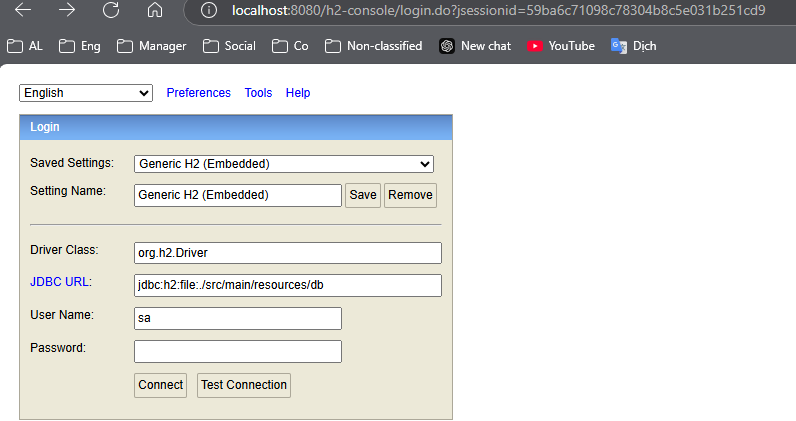

1. Demo các thuộc tính thường gặp trong quá trình phát triển để thông thạo cách xử lý các thuộc tính đó trong tực t
2. Hàm test() ở class DemoController dùng để giữ chương trình không tắt ngay sau khi chạy
3. Trong application cần lưu ý
   - Đặt dẫn tuyệt đối để lưu data: spring.datasource.url=jdbc:h2:file:D:/PE_folder/PE_Work/Demo_Projects/BE-Java-Sping-Demos/demo-attributes-in-entities/src/main/resources/db/testdb;DB_CLOSE_DELAY=-1;AUTO_SERVER=TRUE
   - Path truy cập H2 DB: spring.h2.console.path=/h2-console
   - Khi truy cập vào path H2-DB thì cần thay đổi row JDBC URL theo cấu hình thư mục chưaDB: jdbc:h2:file:./src/main/resources/db
     - 
4. Mã ticket cho dự án là: DAIE
5. Đặt tên commit theo cú pháp: #INNO-60 feat: [Change text]
6. Cần thêm dữ liệu cho bảng Parent và Another trước khi insert dữ liệu cho bảng MainAttributesContainer